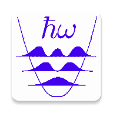

# Quantum Harmonic Oscillator 

This repository contains the source code of the [Quantum Harmonic Oscillator app for Android](https://play.google.com/store/apps/details?id=com.vlvolad.quantumoscillator)

The code is designed to be used via Android Studio with Gradle.

## Short description of the app 

The app visualizes the electron orbitals of the 3D quantum harmonic oscillator by using OpenGL.
More specifically, the hypersurfaces of constant spatial electron probability density of the different orbitals are drawn, exploiting the known exact solution of the Schroedinger equation.

The quantum numbers *n*, *l*, and *m*, the probability *P* to find electron inside the orbital, and the discretization level can all be varied.
Choice between complex and real (in azimuthal angle) basis of wave functions is possible.

The visualization is performed by dynamically generating the hypersurfaces with the [Marching Cubes](http://paulbourke.net/geometry/polygonise/) algorithm. Orbitals can be interactively zoomed and rotated.

This is a sister app of [Hydrogen Atom Orbitals](https://github.com/vlvovch/hydrogen-atom-orbitals)
